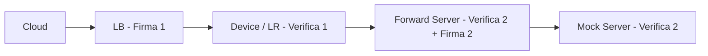

# 🌐 Pipeline Sicura di Deploy e Forward

Cloud → LB → Device → Forward → Mock

---

## 📌 Obiettivo

Garantire l’autenticità e l’integrità delle richieste lungo tutta la catena:

```
[Cloud / LB] → [Device / LR] → [Forward server] → [Mock server / Target]
```

Ogni tratto utilizza **firma HMAC-SHA256** calcolata su `body + ":" + timestamp`, aggiunta negli header HTTP senza modificare il payload.

---

## 🧰 Componenti

| Componente               | Porta | Funzione                                                                 |
|---------------------------|-------|---------------------------------------------------------------------------|
| Load Balancer (LB)       | 5002  | Riceve richieste di deploy dal cloud, firma e inoltra al device          |
| Device / LR              | —     | Verifica la firma LB e deploya funzioni Nuclio                           |
| Forward Server           | 3000  | Verifica firma del device e inoltra ai target con nuova firma           |
| Mock Server              | 8080  | Verifica la firma e risponde con echo                                    |

---

## 🔐 Meccanismo di Firma HMAC

### Algoritmo

```
signature = HMAC_SHA256(secret, body_raw + ":" + timestamp)
```

- **secret** → chiave segreta condivisa  
- **body_raw** → corpo JSON originale (non modificato)  
- **timestamp** → UNIX epoch (es. `date +%s`)

### Header HTTP

```
X-Signature: sha256=<digest>
X-Signature-Timestamp: <timestamp>
```

Comportamento lato server:

- Se header assenti → accetta (modalità legacy)  
- Se presenti → ricalcola e confronta in modo sicuro  
- Se firma errata o timestamp scaduto (>300s) → 401 Unauthorized

---

## ☁️ 1️⃣ Cloud → LB

L’utente esegue una `curl` normale di deploy verso il Load Balancer.  
LB firma automaticamente e inoltra al device.

### Esempio

```bash
curl -X POST http://<LB_IP>:5002/deploy-github \
  -H "Content-Type: application/json" \
  -d '{
    "name": "pippo",
    "githubUrl": "https://raw.githubusercontent.com/utente/FaaS4Things/refs/heads/cloverleaf/handler_python",
    "runtime": "python",
    "platform": "local",
    "buildCommand": "pip install requests",
    "handler": "handler_python:handler"
  }'
```

---

## 💻 2️⃣ LB → Device / LR

Il device verifica la firma e, se valida, esegue il `nuctl deploy`.

### Variabili d’ambiente

```bash
export LB_SECRET="super_lb_secret"
export IOT_SECRET="super_lb_secret"
```

---

## 📡 3️⃣ Device → Forward Server (3000)

Il device firma la richiesta con `FORWARD_SECRET` e la invia al Forward server.

### Esempio firma + curl in bash

```bash
SECRET="forward_secret_123"
BODY='{"variable":"server1","function":"getData"}'
TS=$(date +%s)
SIG=$(printf "%s:%s" "$BODY" "$TS" | openssl dgst -sha256 -hmac "$SECRET" | awk '{print $2}')

curl -X POST http://localhost:3000/forward \
  -H "Content-Type: application/json" \
  -H "X-Signature: sha256=$SIG" \
  -H "X-Signature-Timestamp: $TS" \
  -d "$BODY"
```

Il Forward server verifica la firma.  
Se valida → inoltra al mock server con una **nuova firma**.

---

## 🛰️ 4️⃣ Forward → Mock (8080)

Il mock server verifica la firma ricevuta e risponde con echo.

### Risposta esempio

```json
{
  "success": true,
  "forwardedTo": "http://localhost:8080",
  "data": {
    "success": true,
    "echo": {
      "variable": "server1",
      "function": "getData"
    },
    "mockResponse": "Risposta di test dal mock server"
  }
}
```

---

## 🔑 Gestione Segreti

| Tratto                          | Variabili                     | Note                                                 |
|---------------------------------|-------------------------------|------------------------------------------------------|
| LB → Device                     | `LB_SECRET`, `IOT_SECRET`    | Devono coincidere                                  |
| Device → Forward → Mock         | `FORWARD_SECRET`            | Deve essere la stessa su device, forward e mock    |

### Esempio

```bash
export LB_SECRET="super_lb_secret"
export IOT_SECRET="super_lb_secret"
export FORWARD_SECRET="forward_secret_123"
```

---

## 🧪 Test Completo

1️⃣ Avvia i servizi:

```bash
python3 loadBalancer.py
node iot_server.js
node serverino.js &
node mock.js &
```

2️⃣ Esegui la curl di deploy (Cloud → LB → Device).  
3️⃣ Esegui la curl firmata (Device → Forward → Mock):

```bash
SECRET="forward_secret_123"
BODY='{"variable":"server1","function":"getData"}'
TS=$(date +%s)
SIG=$(printf "%s:%s" "$BODY" "$TS" | openssl dgst -sha256 -hmac "$SECRET" | awk '{print $2}')

curl -X POST http://localhost:3000/forward \
  -H "Content-Type: application/json" \
  -H "X-Signature: sha256=$SIG" \
  -H "X-Signature-Timestamp: $TS" \
  -d "$BODY"
```

Se tutto è corretto → ricevi la risposta del mock firmata e inoltrata.

---

## 📋 Vantaggi

- ✅ Autenticità dei messaggi su ogni hop  
- ✅ Payload intatto (firma negli header)  
- ✅ Anti-replay con timestamp  
- ✅ Compatibilità retroattiva  
- ✅ Semplice, portabile e leggibile

---

## 📝 Schema (Mermaid)



